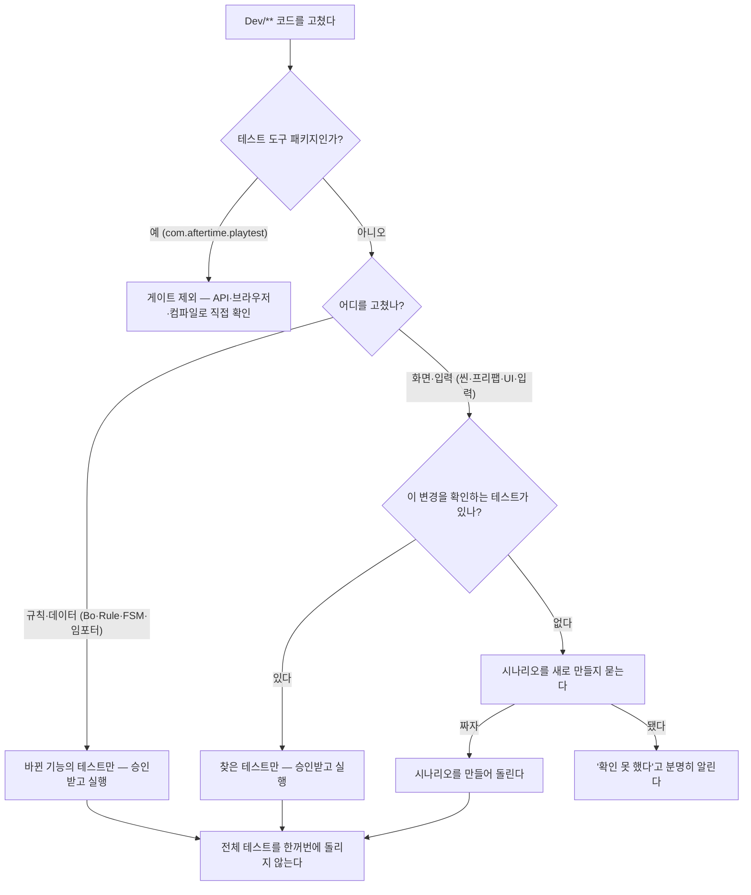

# 검증 (Dev/** 수정 후)

> 하드 게이트: `.claude/hooks/playtest-gate.ps1` (Stop 훅) — 이 문서는 절차 SSOT.

## 검증 실행 승인 (강함 — 이 절이 다른 모든 절보다 우선)

**테스트·시나리오 실행은 사용자 승인 후에만 한다.** 실행 위치가 agent라도 예외 없다 — agent라서 승인이 필요 없다는 판단은 금지다.

승인이 필요한 대상 (전부):

- `run_tests` — EditMode·PlayMode 모두
- 패널 API 실행 — `POST /api/run`, `/api/run-scenario`
- `manage_editor` play, `execute_code`로 테스트·Play 유발
- **원본→agent 동기화**(`agent-mirror-sync.ps1`) — 검증 절차의 일부이므로 함께 묻는다

승인이 필요 없는 것 (검증이 아니다):

- 컴파일 확인 — `refresh_unity` + `read_console`
- 조회 — `/api/info`, `/api/tests`, `/api/scenarios`, 생존 프로브, 락 확인, 조회용 `execute_code`

절차:

1. 구현이 끝나면 **실행하지 않고 멈춘다.**
2. `AskUserQuestion` 1회로 **"무엇을·어디서·왜 돌릴지"** 를 제시하고 승인을 받는다. 질문 문구에 **"플레이 테스트"** 를 반드시 포함한다 (Stop 훅 판정 needle — 이 문구가 없으면 훅이 턴 종료를 막는다).
3. 덮는 테스트가 없으면 §PlayMode 절차의 4지선다를 **같은 질문에 합쳐** 묻는다 (턴 수 낭비 금지).
4. 거절·무응답이면 **실행하지 않고 "미검증"을 명시 보고**하고 종료한다. 조용히 넘기지 않는다.

**구현 직후 검증으로 자동 진행하지 않는다.** Stop 훅이 검증을 요구한다는 이유로 승인을 건너뛰지 않는다 — 훅은 **승인 요청(위 needle)** 으로 만족시킨다.

## 라우팅 — 무엇으로 검증하나

**PlayMode는 에디터당 1개만 돌 수 있는 희소 자원이다.** 모든 수정을 PlayMode로 보내면 에이전트가 늘어날수록 큐만 길어진다. 수정 경로로 라우팅한다 (훅이 자동 판정).

**누가** 메인이 턴 끝에 한 번만 (서브에이전트는 돌리지 않는다) · **어디서** 웹 패널(시나리오) 검증은 agent 전용, 직접 `run_tests`는 원본·미러 둘 다(대상 인스턴스 명시) · **기록** 패널 기록은 agent · **승인** 실행 전 사용자 승인 필수(§검증 실행 승인) · **전체 회귀** 사용자가 직접 요청할 때만.

| 수정 경로 | 검증 | 사용자 질문 |
|---|---|---|
| **`Dev/Packages/com.aftertime.playtest/**` (테스트 도구 자체)** | **게이트 제외** — 이 패키지를 검사하는 테스트가 없다(게임을 검사하는 테스트만 존재). 대신 **패널 API 실측 + 브라우저 DOM 확인 + 컴파일 에러 0** 으로 검증하고 결과를 보고한다 | 조회·컴파일 확인은 불필요. **실행을 수반하면 승인 필수** |
| `.unity`, `.prefab`, `Scripts/**/UI/**`, `*View/Layout/Overlay/Panel/Hud/Popup/Toast.cs`, `*Input*.cs`, `Tests/PlayMode/**` | **PlayMode** — **덮는 시나리오·테스트만 지정 실행** (agent 패널 `POST /api/run`·`/api/run-scenario`, 또는 `test_names`). 전량은 요청 시에만 → §PlayMode 절차 | **실행 승인 필수.** 덮는 게 없으면 시나리오 작성 여부를 **같은 질문에 합쳐** 묻는다 ("플레이 테스트" 문구 포함) |
| 그 외 `Dev/**` — Bo·Model·Rule·Turn·FSM·Run·임포터·데이터(`.asset`) | **EditMode** `run_tests` — **변경한 기능을 덮는 테스트만** (`test_names`/`group_names`/`category_names`). 전량 `Assembly-CSharp-Editor`는 사용자 요청 시에만 → §검증 범위 | **승인 필수** — 무엇을 왜 돌릴지 1줄 + 승인 요청 ("플레이 테스트" 문구 포함) |

- EditMode는 Play 진입이 없어 **씬을 뺏지 않고 수 초**에 끝난다 — 지정 실행이면 더 빠르다. 그래도 **전량 회귀는 매 변경마다 돌리지 않는다** (§검증 범위).
- **둘은 잡는 것이 다르다 — 개수로 비교하지 않는다.** EditMode는 규칙·계산·데이터를, PlayMode 스모크·시나리오는 **실제 입력 경로(드래그·클릭)·레이아웃·연출 타이밍**을 잡는다. 후자는 EditMode가 원리적으로 못 잡는 영역이다.
- `.asset`(SO) 값 변경은 기본 EditMode다. 화면 표시가 걸린 변경이라 판단되면 PlayMode도 요청한다.
- **검증은 오케스트레이터가 턴 끝에 1회 (하드 게이트).** 서브에이전트의 `run_tests`는 훅이 거부한다 — 에이전트마다 돌리면 agent 하나를 두고 큐가 N배가 된다. 서브에이전트는 "변경 요약 + 검증 필요"만 반환하고 종료한다.
  - **서브에이전트 검증 금지 = `run_tests`뿐 아니라 모든 실행 경로.** 패널 API(`/api/run`·`/api/run-scenario`), `manage_editor` play, `execute_code`로 테스트/Play 유발 — 전부 금지다. 우회로 돌리면 같은 위반이다.
  - **오케스트레이터가 위임할 때 이 금지를 핸드오프에 명시한다.** 구현 지시에 "검증 절차"를 넣지 않는다 — 넣으면 서브에이전트가 12회씩 돌려 큐·토큰이 폭증한다(실측).
  - 예외: **컴파일 확인**(`refresh_unity` + `read_console`)은 검증이 아니므로 서브에이전트도 허용. 컴파일 깨진 채 반환하면 안 된다.
- ⚠️ **공유 트리 스냅샷의 한계:** 여러 에이전트가 원본을 동시에 고치는 중이면, 동기화 시점에 **다른 에이전트의 진행 중 코드까지 agent로 복사**된다(누가 sync를 부르든 동일). 그래서 검증 실패가 내 변경 탓인지 남의 미완성 탓인지 섞일 수 있다. 완화책: **sync 전 원본 `read_console`로 컴파일 클린을 먼저 확인**(깨졌으면 검증 보류 — §agent 인스턴스)하고, 그래도 못 걸러지면 **배치가 끝난 뒤 검증한다.** 진행 중에 돌린 결과는 그렇게 해석한다.

## PlayMode 3분류 (코드 `[Category]` · 노코드 `categories`)

PlayMode 검증은 **코드 테스트와 노코드 시나리오 모두** 크기·중요도로 셋으로 나눈다. 코드는 NUnit `[Category]`, 노코드는 시나리오 JSON의 `categories` 배열 — **어휘·의미는 동일**하고 웹 패널 카테고리 칩이 둘을 함께 모아 필터한다. 코드 지정 실행은 `run_tests`의 `category_names`(또는 `test_names`), 노코드는 패널에서 칩으로 골라 실행한다.

| 분류 | 범위 | 언제 |
|---|---|---|
| **스모크** | 부팅 + 핵심 입력 1~2개 | 화면·입력 변경 시 기본 실행 후보 |
| **정밀** | 기능 상세 분기(타겟팅·취소·연출 등) | 그 기능을 고친 턴에만 지정 실행 |
| **회귀** | 기능별 대표 1개에 겸직 태그(복수 부착) | **사용자 명시 요청 시에만** 세트 실행 |

- **회귀는 새 테스트가 아니라 겸직 태그다.** 코드는 기존 스모크/정밀 테스트 중 기능별 대표 1개에 `[Category("회귀")]`을 함께 붙이고, 노코드는 대표 시나리오의 `categories`에 `"회귀"`를 함께 넣어 세트를 구성한다. 현재 코드 대표 3건: 카드 조작(`BattleCardDragSmokeTest`)·이벤트(`EventPanelSmokeTest`)·휴식(`RestDrinkIconSmokeTest`).
- **회귀 세트는 사용자가 "회귀 돌려" 등으로 명시 요청할 때만 실행한다.** 평소 턴 끝 검증은 변경분을 덮는 스모크/정밀만 지정 실행한다(아래 §검증 범위와 동일 취지 — 매 변경 전량 회귀 금지).
- **노코드 시나리오 분류**는 시나리오 JSON의 `categories`(다중 태그, 어휘 스모크/정밀/회귀)로 지정한다. 편집은 웹 패널 시나리오 에디터의 분류 체크박스로 한다. 태그가 없는 시나리오는 칩 필터에 잡히지 않을 뿐 실행에는 문제없다.

## 검증 범위 — 변경분만 (강함)

- 기능 **추가·수정·삭제** 시 검증은 **그 변경이 건드린 기능의 테스트만** 돌린다. 신규 기능이면 그 기능을 덮는 테스트를 새로 작성해 **그것만**, 수정이면 그 기능을 덮는 기존 테스트만 **지정 실행**한다 (`test_names` / `group_names` / `category_names` — `assembly_names: ["Assembly-CSharp-Editor"]` 전량 금지).
- **전체 회귀 스위트(EditMode 전량 `Assembly-CSharp-Editor`, PlayMode 전량)는 사용자가 명시적으로 요청할 때만** 돌린다. 매 변경마다 전량 회귀 금지 — 느리고, 변경과 무관한 실패로 신호가 묻힌다.
- 훅은 **"변경분 검증이 1회 있었는가"만 하드 게이트**한다(어떤 테스트를 골랐는지 스코프는 강제하지 못한다). 지정 실행으로 게이트를 만족시키고, 전량 회귀는 사용자 요청 시에만 붙인다.
- PlayMode도 동일 — 변경한 화면/시나리오를 덮는 테스트만 지정 실행하고, PlayMode 전량은 요청 시에만.

## PlayMode 절차 (메인 에이전트)

**실행은 언제나 승인 후에만 한다** (§검증 실행 승인). 덮는 테스트가 없으면 "무엇으로·어디서 검증할지"까지 **한 번의 `AskUserQuestion` 4지선다**에 합쳐 묻는다. 질문 문구에 **"플레이 테스트"** 를 반드시 포함한다(훅 판정 needle).

1. **덮는 테스트·시나리오가 있는지 먼저 확인한다** (agent 패널 `/api/scenarios`, `Dev/Assets/Tests/PlayMode/**`). 조회는 승인 없이 해도 된다.
2. **있으면 → 그것만 agent에서 지정 실행하되, 실행 전 승인을 받는다.** `run_tests`의 `test_names`, 또는 패널 `POST /api/run-scenario`(agent)로 그것만. agent라는 이유로 승인을 생략하지 않는다.
3. **없으면 → 4지선다 `AskUserQuestion`:**

   | 선택지 | 어디서·누가 실행 | sync | 잡는 것·비고 |
   |---|---|---|---|
   | **① PlayMode (원본)** | 원본·**Claude 실행**(`run_tests`, 원본 인스턴스 명시) | ❌ | 입력·레이아웃·연출. 코드 `[UnityTest]`를 **직접 실행 — 웹 패널 안 탐**. 사용자가 원본에서 Play 중이면 게이트가 막음 → ②·④로 |
   | **② PlayMode (agent 미러)** | 미러·**Claude 실행**(웹 패널/시나리오) | ✅ | 입력·레이아웃·연출. 격리. sync·컴파일 클린 선확인 |
   | **③ EditMode (원본)** | 원본·**Claude 실행**(`run_tests`, 원본 인스턴스 명시) | ❌ | 규칙·계산·데이터. Play 진입 없음 → 가장 빠름 |
   | **④ 안 함** | — | — | 검증 없이 종료, "미검증" 명시 보고 |

   - **모든 실행은 실행 전 승인**(§검증 실행 승인) — agent라는 이유로 승인 생략 금지.
   - **①③(원본)은 `run_tests`를 원본 인스턴스로 명시해 직접** 돌린다 — 미러 강제 없음(`unity-playmode-gate`는 "원본이냐 미러냐 대상 명시"만 요구). **웹 패널·sync 불필요.** 단 사용자가 원본에서 Play 중이면 게이트가 막으니 ②나 ④로.
   - **②(미러)만 웹 패널 플로우**(`/api/run`·시나리오·녹화, sync 선행). 기록도 미러 패널.
   - 화면·입력·연출이면 ①②, 순수 로직이면 ③이 가장 빠르다(§라우팅).
4. **덮는 게 없다는 이유로 전량 회귀를 대체 실행하지 않는다.** 전량은 사용자가 명시 요청할 때만 (§검증 범위).
5. 결과 + `TestArtifacts/<타임스탬프>/step*.png`를 `Read`로 판독해 실제 화면 기준으로 보고한다 (①=원본 `TestArtifacts`, ②=agent `TestArtifacts` — 집계 패널이 출처 뱃지로 구분).
6. **④(안 함) 시:** 검증 없이 종료하되 **"미검증"을 명시 보고**한다 (조용히 넘기지 않는다).
- 어셈블리 단위로 돌릴 때만 **필터 `Aftertime.SOS.Tests.PlayMode` 필수** (`testables` 등록으로 InputSystem 패키지 테스트까지 노출되므로 필터 없이 실행 금지). 기본 경로는 지정 실행이다.
- CLI `-batchmode`는 렌더링이 없어 스크린샷이 검게 나온다 — 기본 실행 경로는 에디터(unityMCP).

## agent 인스턴스 (에이전트 검증 전용 Unity)

> **용어:** 검증 전용 사본을 **agent**, 사용자 작업용을 **원본**이라 부른다(문서·UI 공통). 스크립트·설정 파일명(`agent-mirror-sync.ps1`, `.claude/agent-mirror.json`, `mirrorRoot`·`mirrorProject` 키)은 훅이 참조하므로 **이름을 바꾸지 않는다**.

> 하드 게이트: `.claude/hooks/unity-playmode-gate.ps1`. `.claude/agent-mirror.json`이 있고 `enabled: true`면 agent 모드로 동작한다.

**원본(`SOS/`)이 SSOT, agent(`SOS-agent/`)는 검증용 사본이다.** agent에는 작업물이 없고 언제든 지우고 다시 만든다. 이 구조의 목적은 하나 — **원본의 Play 버튼은 항상 사용자 것**.

**[사용자 방침] 웹 패널(포트) 플로우 — 시나리오·녹화·기록 — 은 agent에서만** 한다. 원본 패널에서 패널 검증을 실행하지 않는다. **원본에서는 웹 패널을 거치지 않는 직접 `run_tests`(코드 `[UnityTest]`) 플로우만** 쓴다 (별도 플로우 — §PlayMode 절차 ①③). 즉 "미러=웹 패널 / 원본=직접 run_tests" 로 플로우가 갈린다.

- **포트는 인스턴스별로 고정이다 — 원본 17700 / agent 17800** (2026-08-06 구현·실측). `PlaytestSettings`가 프로젝트 루트의 마커 `.playtest-agent`를 보고 base 포트에 `AgentPortOffset(+100)`을 적용한다. 마커는 동기화 대상(`Assets`·`Packages`·`ProjectSettings`) **밖**이라 `/MIR`에 지워지지 않는다.
  - 그 전까지는 둘 다 17700을 원해 **먼저 뜬 에디터**가 가져가고 나중 것이 +1로 밀렸다 — 리로드 순서에 따라 뒤집혀 검증이 사용자 에디터로 가는 사고가 있었다(2026-08-05 agent=17701 → 08-06 agent=17700). 이 사고 경로는 닫혔다.
  - **그래도 포트만 믿고 쓰지 않는다.** 외부 앱이 17800을 점유하면 폴백(+1~+10)이 여전히 작동하고, 마커 없는 사본을 만들면 원본 대역으로 뜬다. 포트는 **첫 시도 대상**이고 확증은 아래 `isAgent`다.
- **쓰기 전 반드시 식별한다.** `GET /api/info`의 **`isAgent`**(마커 파일 `{프로젝트루트}/.playtest-agent` 기반) 또는 **`projectPath`**(`SOS-agent` 포함 여부)로 확인하고 그 포트에만 실행을 건다. `projectName`은 agent가 `ProjectSettings`까지 복사해 **원본과 값이 같으므로 구분에 쓸 수 없다**.
- ⚠️ **식별과 생존은 다른 질문이다 — 식별만으로는 죽은 에디터를 못 걸러낸다 (실측: 2026-08-06).** `isAgent`·`projectPath`·`/api/status`·프로세스 `Responding`·포트 LISTEN은 **전부 메인 스레드 없이 응답**한다. 모달 대화상자가 메인 스레드를 붙잡고 있어도 이 신호들은 정상으로 보인다(그날 84분을 그렇게 날렸다).
  - **세션 첫 검증 전 생존 프로브 1회.** `GET /api/tests`를 **15초 타임아웃**으로 부른다 — 이 엔드포인트는 메인 스레드 작업이 필요하다. 응답하면 살아 있고, **걸리면 에디터가 멈춘 것이다**(살아 있는 agent는 1초 내에 답한다). 같은 세션의 이후 검증에서는 프로브를 생략하되, **`run_tests` 무응답·타임아웃·`sync-blocked-dialog:` 출력 등 이상 신호가 보이면 다시 프로브**한다 — 생략은 지름길이지 면제가 아니다.
  - **멈췄으면 기다리지 않는다.** 폴링 루프·대기 스크립트로 붙잡고 있으면 영원히 끝나지 않는다. 원인을 확인해 **사용자에게 보고하고 검증을 보류**한다.
  - 가장 흔한 원인은 **동기화가 열려 있던 씬을 덮어써서 뜨는 Unity 모달**(`The open scene(s) have been modified externally` · `Reload`/`Ignore`)이다. agent 창에는 아무도 앉아 있지 않아 스스로 닫히지 않는다.
  - `agent-mirror-sync.ps1`이 동기화 직후 이 창을 탐지해 **`sync-blocked-dialog:`** 로 시작하는 줄을 출력한다(exit code는 0 유지 — `agent-mirror-setup.ps1`이 sync의 exit code를 실패로 판정하므로 바꾸지 않는다). **동기화 출력에서 이 줄을 확인한다.**
  - **버튼은 사람이 누른다.** 스크립트·에이전트가 자동으로 클릭하지 않는다 — 대상을 오인해 **원본**의 같은 대화상자를 누르면 사용자의 저장 안 된 씬 작업이 복구 불가능하게 사라진다. 탐지만 하고 사용자에게 알린다.
  - 직접 확인하려면 agent Unity 프로세스가 소유한 `#32770` 클래스 창을 본다. 메인 창이 `enabled=False`면 모달에 막힌 것이다.
- **실행 경로**: 확인된 agent 포트에 `POST /api/run` (코드 테스트 `testNames[]` + 시나리오 `scenarioIds[]` 혼합 가능) 또는 `/api/run-scenario`. agent 에디터가 실행·기록하므로 인스턴스 라우팅 함정도 우회된다.
- agent 패널이 꺼져 있으면 먼저 기동한다 — agent 인스턴스에서 `PlaytestPanelServer.OpenPanel` 호출(빈 포트로 자동 폴백). `[MenuItem]`이 `OpenPanel`·`StopFromMenu` 둘이라 리플렉션으로 **메서드명을 정확히 지정**한다(루프로 마지막 것을 잡으면 서버를 끈다).
- **패널은 자기 API로 시작한 실행만 기록한다.** MCP `run_tests`·Unity Test Runner 창으로 돌린 것은 패널 기록에 남지 않는다 — 기록이 목적이면 패널 API를 쓴다. EditMode는 스크린샷을 만들지 않는다.
- 결과를 보고할 때 **어느 패널(원본/agent)인지 포트와 함께 명시**한다.

- 경로: `C:\UnityProjects\SOS-agent\sos_agent` (설정은 `.claude/agent-mirror.json`의 `mirrorRoot` + `mirrorProject`). **폴더명이 Unity 프로젝트명이자 MCP 인스턴스 이름(`Name@hash`)이므로 원본의 `Dev`와 다르게 둔다** — 창 제목·Hub·인스턴스 핀에서 원본/agent를 눈으로 구분하기 위함.
- 최초 1회: `.claude/scripts/agent-mirror-setup.ps1` → 사용자가 Unity Hub로 `{agent루트}\{mirrorProject}`를 열어 첫 임포트(약 6 GB). 되돌리기: `-Disable`.
- **미러(②)에서 검증하기 전 항상:** `.claude/scripts/agent-mirror-sync.ps1` (단방향 robocopy `/MIR`, `Assets`·`Packages`·`ProjectSettings`만) → agent 인스턴스에 `refresh_unity` → `run_tests`/패널. **동기화는 이제 하드 게이트가 아니라 소프트 선확인**이다 (훅은 더 이상 sync 누락을 deny하지 않는다 — 원본 직접 실행 ①③은 코드가 이미 원본에 있어 sync 자체가 불필요).
  - **sync 출력이 `sync-ok-nochange:`면 `refresh_unity`를 생략**하고 바로 `run_tests`로 간다 — 복사된 파일이 0개라 리로드할 것이 없다(도메인 리로드 수십 초 절약). `sync-ok:`(변경 있음)면 기존대로 refresh 필수.
  - **동기화·검증은 턴 끝 배치 경계에서 오케스트레이터가 1회만.** Tier S면 메인 작업이 끝났을 때, M·L이면 implementer가 모두 끝났을 때(서브에이전트 idle). 매 편집·서브태스크마다 rolling sync 금지. 서브에이전트는 sync·검증을 하지 않는다(요약 + "검증 필요"만 반환).
  - **sync 전 원본 `read_console`(error)로 컴파일 클린을 먼저 확인한다 — 위험할 때만 사용자에게 묻는다:** 에러 0이면 묻지 말고 바로 sync+검증. **에러가 있으면 sync·검증하지 않고** "소스 컴파일 에러 — 내 변경 탓인지 공유 트리의 다른 세션 미완성 코드 탓인지 확인 필요, 검증 보류"를 보고하고 강행·대기 여부만 `AskUserQuestion`으로 묻는다. sync 후에도 미러 `refresh_unity` → `read_console` 재확인, 여전히 깨졌으면 동일 보류.
  - **사용자 수동 동기화:** 원본 Unity 메뉴 `Aftertime/Playtest/미러로 동기화 + 새로고침`으로 사용자가 직접 트리거할 수 있다 (Claude 툴 호출이 아니라 위 조건과 무관하게 항상 허용). **원본에서만** 실행한다 — agent에서 실행하면 자기 트리를 덮어써 모달이 뜬다.
- **agent에서 씬·SO를 저장하지 않는다** (하드 게이트 — agent를 지목한 `manage_scene save/create`는 거부된다). 다음 `/MIR`에 덮여 사라지므로 씬·SO 편집은 원본에서만.
- ⚠️ **원본에서 씬을 저장하지 않으면 agent에 반영되지 않는다** (dirty 상태는 디스크에 없다). 저장 안 된 변경은 검증에 들어가지 않는다.
- **`run_tests`는 대상 인스턴스를 명시해 원본·미러 둘 다 갈 수 있다** (미러 강제 아님 — `unity-playmode-gate`가 "원본이냐 미러냐" 명시만 요구, EditMode·PlayMode 동일). 미러 대상이면 사용자가 원본에서 Play 중이어도 막히지 않는다(격리). 원본 대상이면 사용자가 Play 중일 때 게이트가 막으므로 그땐 미러로 돌린다.
- **라우팅을 결정하는 건 `set_active_instance` 세션 핀이다. per-call `unity_instance`는 무시될 수 있다 (실측).** `unity_instance="Dev@a55b3871"`로 원본을 지목한 호출이 agent로 갔다. 그래서:
  1. **핀을 목표 인스턴스로 설정**한다 (`set_active_instance`). 검증은 agent, 씬·SO 작업은 원본.
  2. **`execute_code`로 `Application.dataPath`를 찍어 실제 라우팅을 확인**한다 — 이것만이 유일한 근거다. 파괴적 호출(씬 저장·Play 제어·테스트 실행) 전에는 반드시.
  3. 작업이 끝나면 **핀을 agent로 되돌린다** (기본값 = agent라야 사고가 원본으로 가지 않는다).
- **에디터 상태를 바꾸는 호출은 `unity_instance` 필수 (하드 게이트).** 이건 라우팅 보장이 아니라 **의도 선언**이다 — 어느 에디터를 노렸는지 훅이 확인해, 아무 생각 없이 부른 호출을 막는다. 대상: `run_tests`(agent만 허용), `manage_scene` load/open/create/save, `manage_editor` play/pause/stop, **상태 변경 `execute_code`**(코드에 `OpenScene`·`SaveScene`·`isPlaying =`·`EnterPlaymode`·`AssetDatabase.Delete/Move/Save`·`File.*`·`EditorPrefs.Set` 등이 있을 때). 조회용 `execute_code`는 그대로 통과한다.
- 해시는 `~/.unity-mcp/unity-mcp-status-{hash}.json`의 `project_path`로 찾는다(훅이 하는 것과 동일). 핀은 재연결 시 풀리거나 옛 값이 남아 있을 수 있으므로 **매번 dataPath로 확인**한다.
- **동기화 판정은 "내 세션의 `Dev/**` 수정 이후 동기화됐나"** 다. 트리 전체를 스캔하면 다른 세션이 동시에 쓰는 동안 영원히 "agent가 낡음"이 되어 **livelock**이 된다. 내 세션 수정이 없으면 "10분 내 동기화"만 본다.
- **아티팩트 경로가 agent 쪽이다.** `PlaytestSettings.json`의 `artifactRoot: "../TestArtifacts"`는 프로젝트 루트 기준이므로, agent 실행 결과는 `{agent루트}\TestArtifacts\{타임스탬프}\stepNN_*.png` 에 생긴다. 복사하지 말고 그 절대경로를 `Read`로 판독한다.
- 웹 패널은 원본 17700 · agent 17800으로 갈린다(위 포트 절). 패널 좌상단 프로젝트 스위처는 두 대역(17700–17710, 17800–17810)을 모두 스캔하므로 한쪽 패널에서 다른 쪽으로 바로 넘어갈 수 있다.
- **미러 대상 `run_tests`는 원본의 락을 보지 않는다** — 사용자가 원본에서 Play 중이어도 미러 검증은 돈다(격리). **원본 대상 `run_tests`는 원본 락을 존중**한다 — 사용자가 Play 중이면 게이트가 막는다(그땐 미러로). 씬·SO 편집·`manage_editor` 호출도 원본을 향하므로 원본 락 정책(아래)을 따른다.

## PlayMode 점유 시 대기 (에디터 강탈 금지)

**점유자를 밀어내지 않는다.** 단 "기다림"은 짧고 스스로 풀리는 점유에만 쓴다 — 기준은 **락 소유자**다.

| 점유 상태 | 정책 |
|---|---|
| `user-play` (사용자 Play, 30분도 가능) | **즉시 포기** — 대기 금지. Unity 없이 되는 일만 마치고 "검증 보류 — 에디터 점유"로 보고, 오케스트레이터가 나중에 배치 |
| `user-play`인데 대기 스크립트를 띄웠다 | **위반.** 락의 `source`를 **먼저 읽고** 분기한다 — `user-play`면 대기 스크립트 실행 자체가 금지다(20분 맹목 대기 실측 사례). 락을 안 읽고 무조건 대기부터 걸지 않는다 |
| `test-run` (다른 검증, 수십 초) | **대기** — 아래 대기 스크립트 사용 |
| `agent-play` (에이전트가 띄운 Play) | **내가 풀 수 있다** — `manage_editor stop`이 게이트를 통과하는 유일한 점유다. 볼 일을 마쳤으면 대기하지 말고 바로 끈다 |
| 서브에이전트의 모든 Unity 점유 충돌 | **즉시 포기** — 서브에이전트는 절대 큐에 서지 않는다. 놀며 대기하면 컨텍스트를 태우고 busy 마커가 남아 **다른 에이전트의 검증까지 미룬다** |

- **락 = SSOT.** `%TEMP%\claude-sos-playtest\playmode-{에디터 pid}.lock` (에디터 프로세스별 1개, `source`: `user-play` | `test-run` | `agent-play`). 기록자는 `Dev/Packages/com.aftertime.playtest/Editor/PlaytestPlayModeLock.cs`, 하트비트 2초 · 15초 넘으면 stale(에디터 죽음)로 보고 무시.
  - **파일명에서 프로젝트를 유도하지 않는다** — 어느 프로젝트의 락인지는 파일 안 `project` 필드가 SSOT다. 읽을 때는 `playmode-*.lock` 전체를 훑어 `project` 값을 비교한다(경로 정규화 후 비교). 파일명으로 특정 프로젝트의 락을 찾으려 하면 **없는 이름을 찾아 "락 없음"으로 오판**해 남의 Play를 밀어낼 수 있다.
- **`agent-play` = 에이전트가 `manage_editor play`로 띄운 Play.** 게이트가 play를 통과시킬 때 요청 마커(`%TEMP%\claude-sos-playtest\agent-play-request-*.json`)를 남기고, 락 기록자가 Play 진입 때 그것을 소비해 이 값으로 적는다. **`stop`은 이 값일 때만 허용**된다 — `user-play`(사람 Play)·`test-run`(진행 중 런)은 stop도 거부다. 이 구분이 없던 동안 에이전트가 자기 Play를 자기 락으로 막아 사용자가 손으로 Stop을 눌러야 했다(실측: 2026-08-12).
- **대기 방법 (`test-run` 점유에만):** `powershell -NoProfile -File ".claude/scripts/unity-playmode-wait.ps1" -Project <agent경로>` 를 PowerShell 도구 `run_in_background=true`로 실행한다. 해제되면 완료 알림 1회 + exit 0, 한도(기본 **5분** — 검증 런은 수십 초라 그 이상은 이상 상황) 초과면 exit 2. **폴링 루프를 직접 돌리거나 짧은 `sleep`을 반복하지 않는다.** `user-play` 점유에는 이 스크립트를 쓰지 않는다.
- **대기 중:** Unity 상태를 바꾸는 MCP 호출을 하지 않는다 (`read_console` 등 읽기는 허용). Unity 밖 작업은 계속한다.
- **해제 알림 후:** 곧바로 실행하지 말고 **락을 한 번 더 확인**한다 (사용자가 다시 Play를 눌렀을 수 있다).
- **한도 초과(exit 2):** 강제 실행하지 않는다. "검증 미실행 — PlayMode 점유"를 보고하고 턴을 끝낸다.
- 에이전트끼리 겹쳤을 때도 동일 — `TaskStop`으로 죽이지 않는다 (`.claude/rules/agent-concurrency.md`).

## 플레이테스트 패키지·웹 패널 (검증 도구 실체)

**코어는 UPM 패키지 `Dev/Packages/com.aftertime.playtest/`** (게임 비의존 — Runtime: 입력 시뮬레이터·스크린샷 캡처·시나리오 러너·검증, Editor: HttpListener 웹 패널·TestRunner 브리지). 다른 프로젝트 이식 = 패키지 폴더 복사 + `manifest.json` `testables`에 패키지명·`com.unity.inputsystem` 추가 + 그 게임용 어댑터만 신규.

- **웹 패널**: 메뉴 `Aftertime/Playtest/Open Panel` → 원본 `http://localhost:17700` · agent `http://localhost:17800` (각 base에서 사용 중이면 +1~+10 폴백). 3탭 **실행 / 결과 / 기록**. 코드 테스트와 노코드 시나리오가 한 목록이고, 섞어 골라 한 번에 실행하면 **PlayMode 진입 1회**로 시나리오가 순차 실행된다(배치 중 하나가 실패해도 나머지는 계속, 부팅 실패만 배치 중단).
- **노코드 시나리오**: `Dev/Assets/Tests/PlayMode/Scenarios/*.json` (git 추적, **재컴파일 없이 즉시 실행**). 스텝 = 클릭·드래그·대기·스크린샷·검증. 실행 진입점은 패키지의 `PlaytestScenarioTest.RunPendingScenario` 1개 + 핸드오프 파일(`Library/PlaytestPendingScenario.json`) — 큐가 없으면 `Assert.Ignore`.
- **어댑터 계약** `IPlaytestScenarioAdapter` (게임별 1개, 예: `BattlePlaytestAdapter`): 부팅·유휴 대기·대상 카탈로그·이름→화면좌표·이름→GameObject·게임 전용 검증. **어댑터는 "이름 → 오브젝트" 사전이고 판정은 코어가 한다.** 대상에 없는 화면(상점·휴식·맵)은 어댑터를 확장해야 시나리오로 만들 수 있다.
- **검증 2종류**: ① 어댑터 제공(게임 규칙) ② **코어 범용 10종** — 텍스트 포함/일치, 숫자 ≥ ≤ =, 표시 여부, 존재 여부. 범용은 모든 프로젝트에서 어댑터 수정 없이 쓴다. 통과해도 실제 값을 결과에 남긴다.
- **골든 이미지**(`imageCompare` 스텝)와 **와이어프레임 대조**는 **다른 도구다** — 섞지 않는다.

  | | 골든 이미지 (패널) | `docs/wireframe` 절차 |
  |---|---|---|
  | 기준 | **지난 실행 화면**(첫 실행 때 자동 생성, `Dev/PlaytestBaselines/{시나리오}/{라벨}.png`) | **사람이 만든 목업**(`docs/wireframe/refs/*.png`) |
  | 묻는 것 | "지난번과 달라졌나" = 회귀 감지 | "기획 목업대로 배치됐나" = 정답 대조 |
  | 언제 | 매 실행 자동 | UI 신규 제작 시 1회, **사용자가 기준을 지정했을 때만** |

  기본 허용 차이 **5%** — 이 전투 화면은 적 초상 애니메이션·랜덤 드로우로 실행 간 기본 차이가 약 3%다. 0.5%로 낮추면 오탐이 확정된다.

## 테스트 작성 규칙

- PlayMode 위치: `Dev/Assets/Tests/PlayMode/` — asmdef `Aftertime.SOS.Tests.PlayMode` (`UNITY_INCLUDE_TESTS` 제약, 릴리즈 빌드 미포함), 네임스페이스 동일.
- EditMode 위치: `Dev/Assets/Scripts/Editor/BattleTests/` — asmdef 없이 `Assembly-CSharp-Editor`로 컴파일된다.
- 조작은 **가상 디바이스만** (`InputTestFixture` + `HumanInputSimulator` — 실제 이벤트 경로 InputSystemUIInputModule → UGUI). 게임 메서드 직접 호출로 조작을 대체하지 않는다.
- 게임 타입 접근은 reflection (게임 코드 = Assembly-CSharp, 직접 참조 불가) — `BattleSceneTestDriver` 재사용.
- **아티팩트 = 실행이 남기는 증거 묶음** (실행 1회 = 폴더 1개, gitignore됨): 스텝별 스크린샷 `stepNN_{라벨}.png` · 실행 요약 `run.json` · 시나리오 스텝별 성패 `scenario-result.json` · 녹화 시 `run.mp4` · 골든 이미지 diff PNG.
  - 경로: `{Unity 프로젝트 루트의 상위}/TestArtifacts/{yyyy-MM-dd_HHmmss}_{라벨}/` — 예 `TestArtifacts/2026-08-05_174429_hold_drag/`. 캡처 SSOT는 `TestArtifactCapture`, 루트는 `PlaytestSettings.artifactRoot`로 바꿀 수 있다. 최근 30회만 보존(초과분 자동 삭제).
  - **agent에서 돌리면 agent 루트에 생긴다** — 위 agent 절 참조. 복사하지 말고 그 절대경로를 `Read`로 판독한다.
- 테스트를 위해 씬(`.unity`)·SO(`.asset`)·게임 런타임 코드를 수정하지 않는다 (EventSystem 등 부족한 인프라는 테스트가 런타임 생성).
- `[UnityTest]` 시그니처의 `IEnumerator`는 허용 예외 (`.claude/rules/core.md`).
